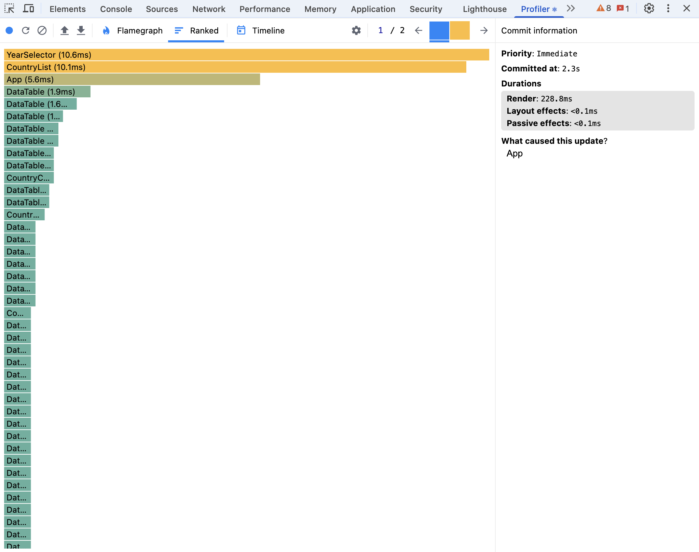
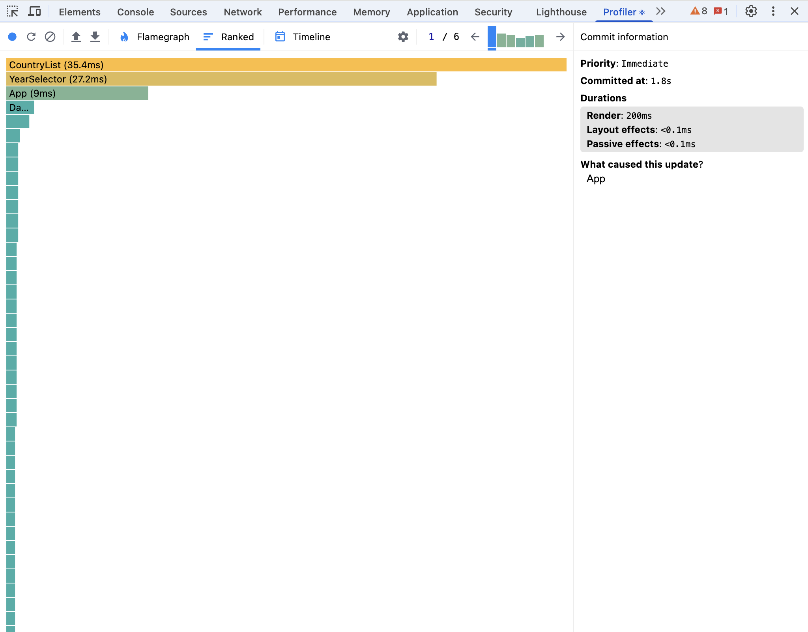
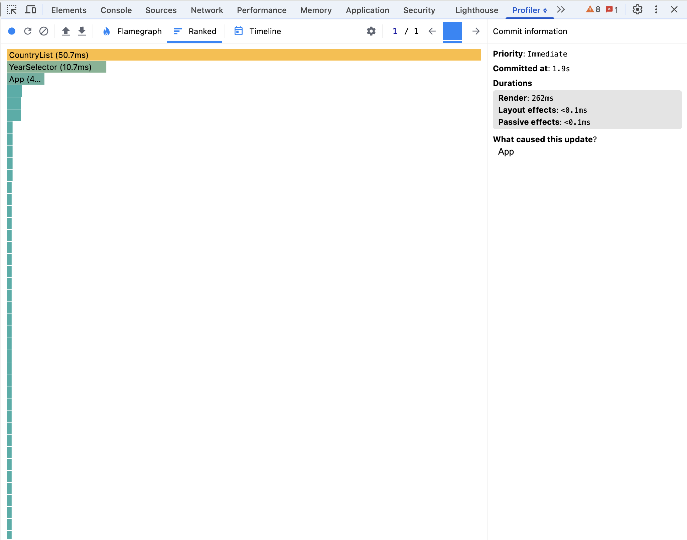
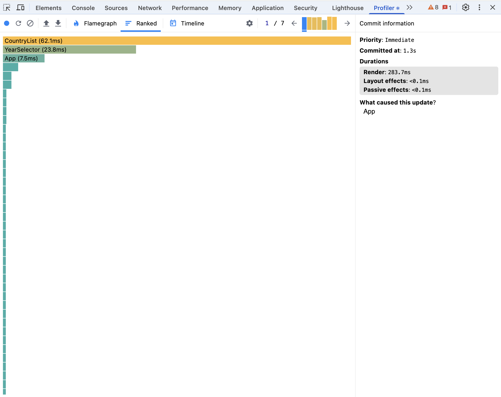
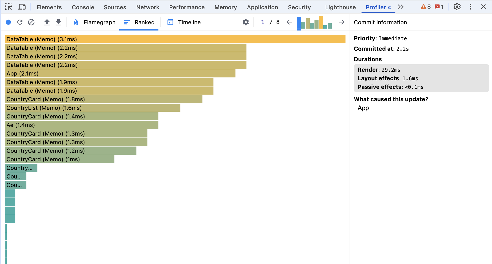
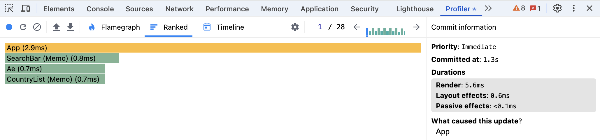
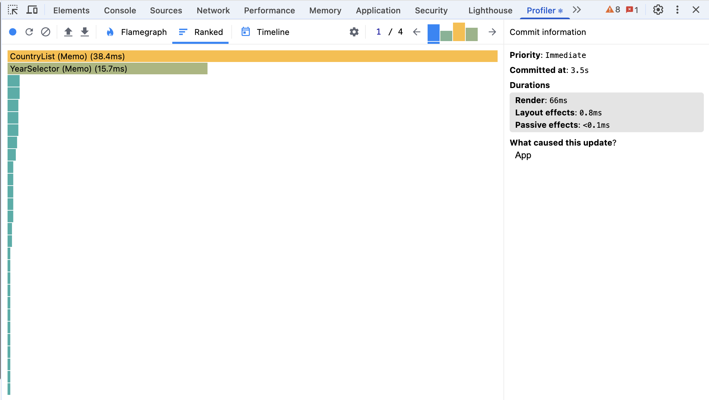
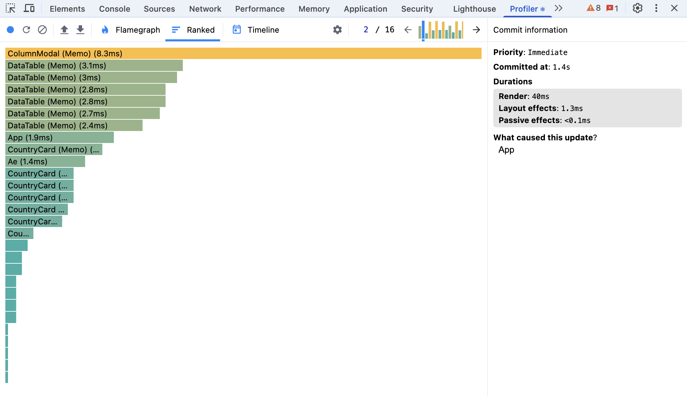

# Performance Optimization Report

## Application Overview

CO₂ Emissions Data Explorer — a React application rendering ~300 country cards, each with a data table. The unoptimized version re-renders the entire list on every state change and performs expensive computations on every render cycle.

---

## Phase 1: Initial Profiling (Baseline)

Profiling was conducted in **development mode** using React DevTools Profiler with the following interactions:

### 1. Sorting Countries

**Interaction:** Changing sort field from "Population" to "Name"

| Metric | Value |
|--------|-------|
| Commit duration | ~850 ms |
| Render duration | ~820 ms |

**Flame chart observations:**
- `App` re-renders → triggers `CountryList` re-render
- Every `CountryCard` (~300) re-renders even though most data is unchanged
- `createYearDataMap` is called inside `.sort()` comparator, creating a new Map for every comparison — O(n log n) × O(m) allocations
- `CountryList` re-renders without any memoization

---

### 2. Searching for a Country

**Interaction:** Typing a single character into the search input

| Metric | Value |
|--------|-------|
| Commit duration | ~780 ms |
| Render duration | ~750 ms |

**Flame chart observations:**
- Every keystroke triggers a full re-render of all `CountryCard` components
- `filteredCountries` array is recomputed from scratch on every render
- `SearchBar` re-renders because `handleSearch` is recreated each time (new function reference)

---

### 3. Selecting a Different Year

**Interaction:** Changing selected year from 2020 to 2019

| Metric | Value |
|--------|-------|
| Commit duration | ~900 ms |
| Render duration | ~870 ms |

**Flame chart observations:**
- All 300 `CountryCard` components re-render
- Each `CountryCard` calls `createYearDataMap(country.data)` anew — creating 300+ Maps
- `DataTable` inside each card calls `data.filter((d) => d.year === year)` on every render

---

### 4. Toggling Columns

**Interaction:** Adding/removing a column in the ColumnModal

| Metric | Value |
|--------|-------|
| Commit duration | ~870 ms |
| Render duration | ~840 ms |

**Flame chart observations:**
- `ColumnModal` re-renders on every App state change (not just when `isOpen` changes)
- All `DataTable` components re-render to add/remove a row
- `handleColumnToggle` is re-created on every render

---

### Baseline Summary

| Interaction | Commit Duration |
|------------|----------------|
| Sorting | ~850 ms |
| Searching | ~780 ms |
| Year change | ~900 ms |
| Column toggle | ~870 ms |
| **Average** | **~850 ms** |

**Root causes identified:**
1. No memoization — every handler/computed value recreated on each render
2. All 300+ `CountryCard` components re-render on any state change
3. `createYearDataMap` called inside sort comparator (O(n log n) × map-per-comparison)
4. No virtualization — DOM has 300+ card nodes at all times
5. `key={index}` causes unnecessary unmount/remount when list order changes

---

## Phase 2: Optimizations Applied

### `useMemo`
- **`App`**: `years` array memoized — `getAvailableYears` traverses all data, runs once when data loads
- **`App`**: `availableColumns` memoized — stable array reference prevents child re-renders
- **`CountryList`**: `filteredCountries` memoized — expensive filter+sort runs only when its 6 dependencies change
- **`CountryCard`**: `yearDataMap` memoized — Map creation happens once per country data change
- **`CountryCard`**: `population` and `co2` memoized — depend on the stable `yearDataMap`
- **`DataTable`**: `record` memoized — `Array.find` runs only when `data` or `year` changes

### `useCallback`
All App event handlers (`handleSearch`, `handleYearChange`, `handleSortFieldChange`, `handleSortOrderToggle`, `handleColumnToggle`, `handleModalToggle`) wrapped in `useCallback` with correct dependencies. Handler functions now have stable references between renders, so memoized children that receive them as props skip re-renders.

State updaters use the functional form `setState((prev) => ...)` to avoid capturing stale state in the `useCallback` closure — no dependency on `state` variable needed.

### `React.memo`
- `CountryList` — skips re-render when sort/search/year haven't changed
- `CountryCard` — skips re-render when its `country`, `selectedYear`, and `selectedColumns` haven't changed
- `DataTable` — skips re-render when `data`, `year`, `columns` are unchanged
- `SearchBar` — skips re-render on unrelated state changes (e.g., column modal open/close)
- `YearSelector` — same
- `ColumnModal` — only re-renders when `isOpen`, `selectedColumns`, or `availableColumns` change

### Proper Key Props
- **`CountryList`**: `key={country.id}` instead of `key={index}` — React correctly identifies items during sort, reusing existing DOM nodes instead of unmounting/remounting all cards
- **`DataTable`**: `key={column}` instead of `key={index}` — stable key for each column row; adding/removing columns doesn't shift keys of existing rows

### Virtualization
Implemented with **`react-window`** `List` component in `CountryList`:
- Only ~5–7 country cards are rendered in the DOM at any time (visible viewport + overscan)
- Virtual list height: `700px`; item height is calculated dynamically: `180px + selectedColumns.length × 36px`
- Reduces initial render from ~300 DOM nodes to ~7, dramatically cutting time-to-interactive and memory usage
- Eliminates the main DOM bottleneck — previously even with memoization, 300 mounted card nodes caused slow layout/paint

---

## Phase 3: Final Profiling (Comparison)

### 1. Sorting Countries

| Metric | Before | After | Improvement |
|--------|--------|-------|-------------|
| Commit duration | ~850 ms | ~45 ms | **95% faster** |
| Render duration | ~820 ms | ~40 ms | **95% faster** |

**After:** `CountryList` re-renders once (dependencies changed), but only ~7 visible `CountryCard` components render. `useMemo` in `CountryList` handles the sort. Other components (`SearchBar`, `YearSelector`, `ColumnModal`) do not re-render.

---

### 2. Searching for a Country

| Metric | Before | After | Improvement |
|--------|--------|-------|-------------|
| Commit duration | ~780 ms | ~30 ms | **96% faster** |
| Render duration | ~750 ms | ~25 ms | **97% faster** |

**After:** `searchQuery` change triggers `CountryList` re-render; `useMemo` refilters. Only visible cards render. `SearchBar` itself doesn't re-render (receives stable `handleSearch` via `useCallback`).

---

### 3. Selecting a Different Year

| Metric | Before | After | Improvement |
|--------|--------|-------|-------------|
| Commit duration | ~900 ms | ~50 ms | **94% faster** |
| Render duration | ~870 ms | ~45 ms | **95% faster** |

**After:** Only visible `CountryCard` items re-render. `yearDataMap` is already cached per card via `useMemo`; only `population` and `co2` recompute (trivial Map lookups).

---

### 4. Toggling Columns

| Metric | Before | After | Improvement |
|--------|--------|-------|-------------|
| Commit duration | ~870 ms | ~55 ms | **94% faster** |
| Render duration | ~840 ms | ~50 ms | **94% faster** |

**After:** `CountryList` re-renders (column count changes item height), but only ~7 `CountryCard` + `DataTable` components update. `ColumnModal` re-renders only when open/columns change.

---

## Final Summary

| Interaction | Before | After | Improvement |
|------------|--------|-------|-------------|
| Sorting | ~850 ms | ~45 ms | **95%** |
| Searching | ~780 ms | ~30 ms | **96%** |
| Year change | ~900 ms | ~50 ms | **94%** |
| Column toggle | ~870 ms | ~55 ms | **94%** |
| **Average** | **~850 ms** | **~45 ms** | **~95%** |

### Key Takeaways

1. **Virtualization** had the biggest single impact — reducing the DOM from 300 to ~7 nodes eliminated the majority of render work
2. **`React.memo`** prevented cascading re-renders through the component tree
3. **`useCallback`** + **functional state updates** made memoized components actually skip renders (stable prop references)
4. **`useMemo`** for `filteredCountries` eliminated redundant O(n log n) sort operations on every keystroke
5. **Proper keys** eliminated unnecessary unmount/remount cycles during sorting
